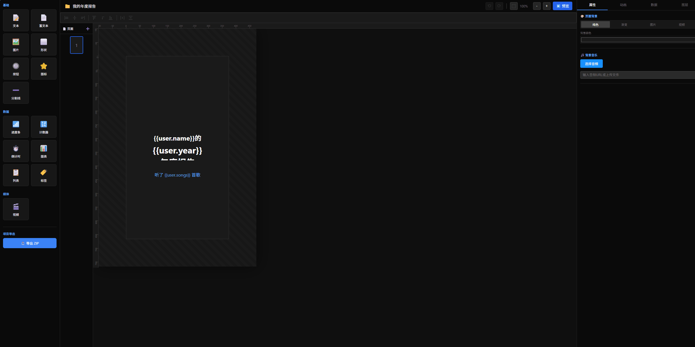
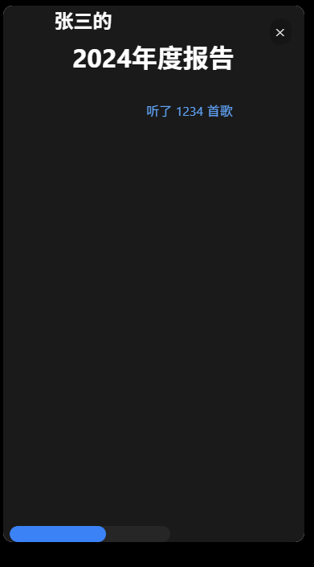

<div align="center">

<!-- LOGO_PLACEHOLDER: Add your logo here -->
<!--  -->

# Year Report Engine

**A Professional Visual Design & Multi-Framework Rendering Solution for H5 Annual Reports**

[](LICENSE)
[](https://www.typescriptlang.org/)
[](https://vuejs.org/)
[](https://reactjs.org/)
[](https://pnpm.io/)

[English](./README.md) | [简体中文](./README.zh-CN.md)

</div>

---

## Overview

Year Report Engine is a powerful, enterprise-grade solution for creating stunning H5 annual reports and interactive presentations. It provides a complete visual design system with a drag-and-drop editor and multi-framework renderers that work seamlessly across Vue 2, Vue 3, and React applications.

<!-- SCREENSHOT_PLACEHOLDER: Add designer screenshot here -->



<!--  -->

## Features

### Visual Designer

- **Drag & Drop Editor** - Intuitive WYSIWYG editing experience
- **Smart Alignment** - Intelligent snap guides and alignment tools
- **Element Grouping** - Group, ungroup, and transform multiple elements
- **Layer Management** - Full control over element z-index and visibility
- **Undo/Redo** - Complete history management (coming soon)

### Rich Components

| Category | Components |
|----------|------------|
| **Basic** | Text, Rich Text, Image, Shape, Video |
| **Charts** | Bar, Line, Pie (powered by ECharts/Recharts) |
| **Shapes** | Rectangle, Circle, Triangle, Diamond, Star, Hexagon |

### Animation System

- **35+ Preset Animations** - Fade, Slide, Zoom, Bounce, Flip, Rotate series
- **Custom Keyframes** - Create complex animations with keyframe editor
- **Animation Timeline** - Visual timeline for sequencing animations
- **Trigger Options** - On enter, after previous, with previous, on click, on delay

### Data Binding

- **Static Data Sources** - JSON data binding
- **Async Data Sources** - REST API integration with auto-refresh
- **Template Syntax** - `{{dataSource.field}}` interpolation
- **Data Transformation** - Custom transform functions

### Multi-Framework Support

```
┌─────────────────────────────────────────────────────────┐
│                    @year-report/core                     │
│              (Framework-agnostic types & utils)          │
└─────────────────────────────────────────────────────────┘
                            │
        ┌───────────────────┼───────────────────┐
        ▼                   ▼                   ▼
┌───────────────┐   ┌───────────────┐   ┌───────────────┐
│ renderer-vue3 │   │ renderer-vue2 │   │ renderer-react│
└───────────────┘   └───────────────┘   └───────────────┘
```

## Demo

<!-- DEMO_GIF_PLACEHOLDER: Add demo GIF here -->
<!--  -->

**Live Demo:** Coming soon  [Live Demo](https://sundykin.github.io/year-report-engine/ "Live Demo")

## Quick Start

### Prerequisites

- Node.js >= 18
- pnpm >= 8

### Installation

```bash
# Clone the repository
git clone https://github.com/user/year-report-engine.git
cd year-report-engine

# Install dependencies
pnpm install

# Start the designer
pnpm dev
```

Open http://localhost:3000 in your browser.

## Usage

### Using the Renderer

#### Vue 3

```bash
npm install @year-report/renderer-vue3
```

```vue
<template>
  <YearReportRenderer
    :data="reportData"
    :request-adapter="fetchAdapter"
  />
</template>

<script setup lang="ts">
import { YearReportRenderer } from '@year-report/renderer-vue3'
import type { ProjectData } from '@year-report/core'

const reportData: ProjectData = {
  title: 'Annual Report 2024',
  author: 'Your Company',
  pages: [/* ... */]
}

// Optional: Custom request adapter for async data sources
const fetchAdapter = async (config) => {
  const response = await fetch(config.url, {
    method: config.method,
    headers: config.headers,
    body: JSON.stringify(config.body)
  })
  return response.json()
}
</script>
```

#### Vue 2

```bash
npm install @year-report/renderer-vue2
```

```vue
<template>
  <YearReportRenderer :data="reportData" />
</template>

<script>
import { YearReportRenderer } from '@year-report/renderer-vue2'

export default {
  components: { YearReportRenderer },
  data() {
    return {
      reportData: { /* ... */ }
    }
  }
}
</script>
```

#### React

```bash
npm install @year-report/renderer-react
```

```tsx
import { YearReportRenderer } from '@year-report/renderer-react'
import type { ProjectData } from '@year-report/core'

function App() {
  const reportData: ProjectData = { /* ... */ }

  return (
    <YearReportRenderer
      data={reportData}
      onPageChange={(index) => console.log('Page:', index)}
    />
  )
}
```

### Using the Designer

```bash
npm install @year-report/designer
```

```vue
<template>
  <YearReportDesigner
    v-model:project="project"
    :request-adapter="requestAdapter"
    :upload-adapter="uploadAdapter"
    @export="handleExport"
  />
</template>

<script setup lang="ts">
import { ref } from 'vue'
import { YearReportDesigner } from '@year-report/designer'
import type { ProjectData } from '@year-report/core'

const project = ref<ProjectData>({
  title: 'My Report',
  author: 'Author',
  pages: []
})

// Custom upload adapter
const uploadAdapter = async ({ file, fileType, onProgress }) => {
  // Upload to your server/CDN
  const formData = new FormData()
  formData.append('file', file)

  const response = await fetch('/api/upload', {
    method: 'POST',
    body: formData
  })

  const { url } = await response.json()
  return { url }
}
</script>
```

## Project Structure

```
year-report-engine/
├── packages/
│   ├── core/                 # Core types, utils, animation scheduler
│   ├── designer/             # Vue 3 visual designer
│   ├── renderer-vue3/        # Vue 3 renderer
│   ├── renderer-vue2/        # Vue 2 renderer
│   └── renderer-react/       # React renderer
├── examples/
│   └── designer-app/         # Designer demo application
└── docs/                     # Documentation (coming soon)
```

## Tech Stack

| Category | Technologies |
|----------|-------------|
| **Language** | TypeScript 5.x |
| **Designer** | Vue 3, Vite |
| **Renderers** | Vue 3, Vue 2, React 18 |
| **Animation** | Animate.css, Anime.js |
| **Charts** | ECharts (Vue), Recharts (React) |
| **Rich Text** | WangEditor |
| **Build** | Vite, pnpm Workspaces |

## Roadmap

See [PLAN.md](./PLAN.md) for the detailed development roadmap.

### Upcoming Features

- [ ] Undo/Redo system
- [ ] More component types (Button, Icon, Progress, Counter, etc.)
- [ ] Conditional rendering
- [ ] Export to image/PDF/video
- [ ] Template library
- [ ] Real-time collaboration

## Contributing

We welcome contributions! Please see our [Contributing Guide](./CONTRIBUTING.md) for details.

1. Fork the repository
2. Create your feature branch (`git checkout -b feature/amazing-feature`)
3. Commit your changes (`git commit -m 'Add some amazing feature'`)
4. Push to the branch (`git push origin feature/amazing-feature`)
5. Open a Pull Request

## License

This project is licensed under the MIT License - see the [LICENSE](./LICENSE) file for details.

## Acknowledgments

- [Animate.css](https://animate.style/) - Animation library
- [Anime.js](https://animejs.com/) - JavaScript animation engine
- [ECharts](https://echarts.apache.org/) - Charting library
- [WangEditor](https://www.wangeditor.com/) - Rich text editor

---

<div align="center">

**If you find this project useful, please consider giving it a star!**

Made with love

</div>
